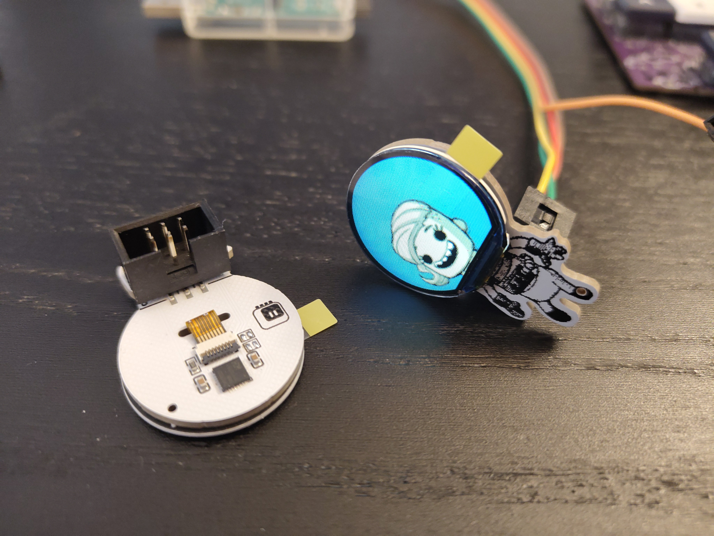

# Duplicant Simple Add On

This is a mini-badge that goes on top of your electronic conference badge,
using a SAO connector. This one is shaped like a duplicant from the Klei
game Oxygen Not Included. The round helmet is a display, that shows the
face of the duplicant from the game, moving slightly and blinking.

There are currently two versions: v1 for the 12-pin 0.99" round display with
a long ribbon cable (GC0907), and v2 for the 8-pin version of the same display,
with a shorter ribbon cable (GC9107). Both use the same firmware.

## Disclaimer

The duplicant character is a creation of Klei Entertainment, and the graphics
used in this project is based on their art. However, this project is a fan
project, and is not officially endorsed or otherwise supported by them. I'm
not selling this, but since the design files and firmware code is available,
you can get your own Duplicant SAO fabricated by one of the many fab houses
out there. They might even be able to flash the firmware for you, otherwise
you will need a special programmer.
